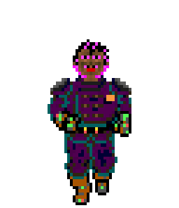

Performance 1: Map Views
========================

There are several aspects we can look at to cause the rendering not to chug:

1) Render fewer canvases
2) Cache the intermediate results of rendering bitmaps with pallets
3) Do less work on the main thread

I want to start addressing 3 because I think any strategy here will benefit us later in other areas, but I doubt it'll make the biggest impact.  First, we start by getting a baseline.

```js
	const start = performance.now();
	const table = renderTableMap(this.map, this.walls, this.pallet);
	this.dom.tableContainer.appendChild(table);
	const end = performance.now();
	console.log(`Rendered map in: ${end - start}ms`);
```

Just wrap the rasterization code and see how long it takes.  On my PC with whatever I'm running now it usually take 1.5 - 2.4 seconds (you should run a few times).

Workers
-------

Probably why more webdevs don't use workers is that they are a little cumbersome.  First, we can't just give a worker code to run, we have to create a worker by loading a script and that script is independent of everything else.  In fact, the path you pass to `new Worker(url)` is relative to the page, not the module you are running in.  This also means that if you want to share it between components, it's a little tricky because you need to figure out how to distribute references to it.  Secondly, workers are designed to be long running and communicate via `postMessage`.  This is a pretty standard web API lots of things use but if you want to just fire off a request and get some data back you need to write some plumbing like so:

```js
export class WorkerDispatcher {
	constructor(worker){
		this.worker = worker;
		this.listeners = new Map();
		this.id = 0;

		this.worker.addEventListener("message", e => {
			const id = e.data.id;

			if(e.data.name === "result"){
				const listener = this.listeners.get(id);
				listener(e.data.result);
				this.listeners.delete(id);
			}
		})
	}
	dispatch(functionName, args){
		const id = this.id;
		this.id++;

		return new Promise((resolve, reject) => {
			this.listeners.set(id, resolve);
			this.worker.postMessage({
				functionName,
				args,
				id
			})
		});
	}
}
```
This basically converts the message channel mechanism into single requests with a query and answer so we can have a nice promise-based API.  You tell the worker what you want to run and with which arguments and an id get associated.  When it communicates back with that id you match it up and resolve that promise.  The worker itself looks like so:

```js
import { renderIndexedBitmap } from "../lib/image-utils.js";

self.onmessage = e => {
	switch(e.data.functionName){
		case "renderIndexedBitmap":
			const indexedBitmap = renderIndexedBitmap(e.data.args[0], e.data.args[1], true);
			self.postMessage({
				name: "result",
				id: e.data.id,
				result: indexedBitmap,
			}, [indexedBitmap]);
	}
};
```
It takes the name mapping and forwards it.  We might make boilerplate if we get a lot of other workers (maybe taking some inspiration from [comlink](https://github.com/GoogleChromeLabs/comlink)) but this is fine for now.  Also, note that modules didn't always work with workers, on older browsers you might need `importScripts` which is an older API that does almost the same thing, just uglier.  In order to use modules you need to create the worker like this: `new Worker(url, { type: "module"})` much like script tags.

We need to make a small change to `renderIndexedBitmap`: `const canvas = offScreen ? new OffscreenCanvas() : document.createElement("canvas");`.  `offsecreen` is a new parameter. This is because we want to use an offscreen canvas in the worker.  The 3rd reason workers are cumbersome is that they don't have direct access to the DOM so there's no creating elements.  Offscreen canvas is an alternative we can use that was made for exactly this and the API is nearly identical.  There's another annoyance too which is that we need to transfer back the image bitmap, because it doesn't like transferring things with open rendering contexts as I found.  So before postMessaging back from the worker we call `.transferToImageBitmap`.  But we still aren't done because we need add a second parameter to the `postMessage` call, an array with the objects we wish to transfer.  This is because by default `postMessage` copies everything and images are big things to copy.  What we want is to simply hand over the reference to the bitmap but this could lead to shared mutable references (the worker starts drawing again while it's trying to render).  This is bad so by adding it to the tranferables we are saying that we're no longer going to use it and we are forbidden from doing so.  This is fine because at least at the moment, the final compositing is done on the main thread.  Now let's run again: 

Rendered map in: ~350ms
Disabled UI for: ~170ms

Much better all around.  We not only saved a lot of time by prerendering the walls, by because its in the background the UI doesn't freeze.  Note that some of the drawing code is moved before render, specifically where I kicked off the wall rendering might cause the first render to delay a bit so visually it doesn't seem that much faster.  We can still do better though.  We're still generating a ton of unnecessary canvas objects.  What we can do instead is have one canvas with the whole map (and generated in our worker) and simply overlay the grid on top.

Round 2
-------

To do this, I'm introducing another intermediate format, the tile map.  I'm not going to go into the code because it's nearly identical to the indexed bitmap, except instead of each value representing a color in a pallet, it represents a tile in a tilemap.  This abstracts the map format so it's easier to render.  So now we send the tile map, list of wall bitmap and the pallet into the `render-worker` and it'll generate the full map image.  Then we just need to absolutely position the grid over the image (the grid doesn't do much yet but I still think it'll come in handy).  With this change the render is now down to ~200ms.  This is pretty acceptable.

I also hooked up the `render-worker` to `index-bitmap` so we can get the benefits of threading there too.

There's always more we can do.  We can parallize rendering walls with more workers, we can do more more with the GPU, we can more of the file parsing in the worker too.  But I think we're okay for now.

Researching Blake Stone
-----------------------

I also did a little research which might be used for a later post.  Basically I wanted to see if I could view Blake Stone assets.  It sort of works but the pallet is off.  Going through a lot of resources it turns out the palette is embedded in the exe itself and unlike Wolfenstien it's not included in the offical source release.  You can find it laid out in some source ports, but that kinda feels like cheating.  I wanted to make a utility that could scan for the pallet block in the binary data.  The gist is let's see if we can just find pattern 0,0,0 (black) followed by something else that looks like a gray color (3-repeating bytes) and so on to see if we can just manually find the offset.  Turns out there aren't any and this is because the exe itself is compressed with a utility called LZEXE.  It looks like if we want to try this out we'll need a way to unpack the exe (there's another program called UNLZEXE and it might make sense to make an implementation for ourselves).

This post is lacking pictures.  So here's what currently happens with the hardcoded Wolfenstien palette:



Souces
------

- https://github.com/GoogleChromeLabs/comlink
- https://github.com/mywave82/unlzexe/blob/master/unlzexe.c
- http://www.shikadi.net/moddingwiki/LZW_Compression