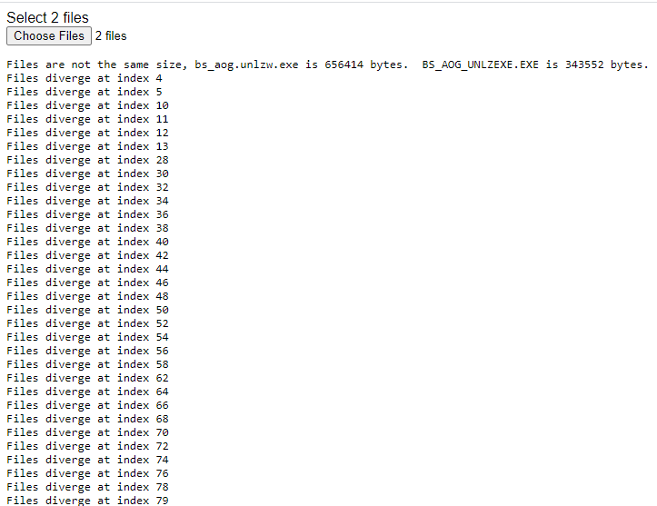

EXE Compression 2: Binary Diffing
===============

The last part was getting rather long so I decided to end without having a 100% working UNLZEXE utility.  While most of the code was working and it could generate output, the output file was about 2x the expected size.  After mindlessly watching the deugger for through about 400 cycles of LZ decompression and getting good results, I felt it was time to find another way to go about this.

The idea is to build a simple binary file diff tool.  This way I can compare to the decompressed file I got with `UNLZEXE` and see where mine starts going off the rails.  Not all of the parts are wrong, so if I can find out where they start diverging I can work back and try to find that part of the source and set some break points to figure out what's going on.

The idea is pretty simple.  Read in two files and compare the lengths.  This will easily tell if they are different but more info is needed.  So we'll walk through each file, byte by byte looking for differences.  Since we expect a lot of them, I'm going to limit how many are printed with an attribute on the custom element.

The output looks like this:

This is okay but I'd like to be able to spot the differences without having to manually dig through the hex editor.  We know some of the headers are going to be messed up because we're not terminating the decompression correctly so we can skip those.  Also, I suspect that some of these could be offset errors in which case all bytes are simply wrong because the position is wrong.  To catch that we'll need to improve the output slightly.  We'll at more of a hex editor interface.

Souces
------
