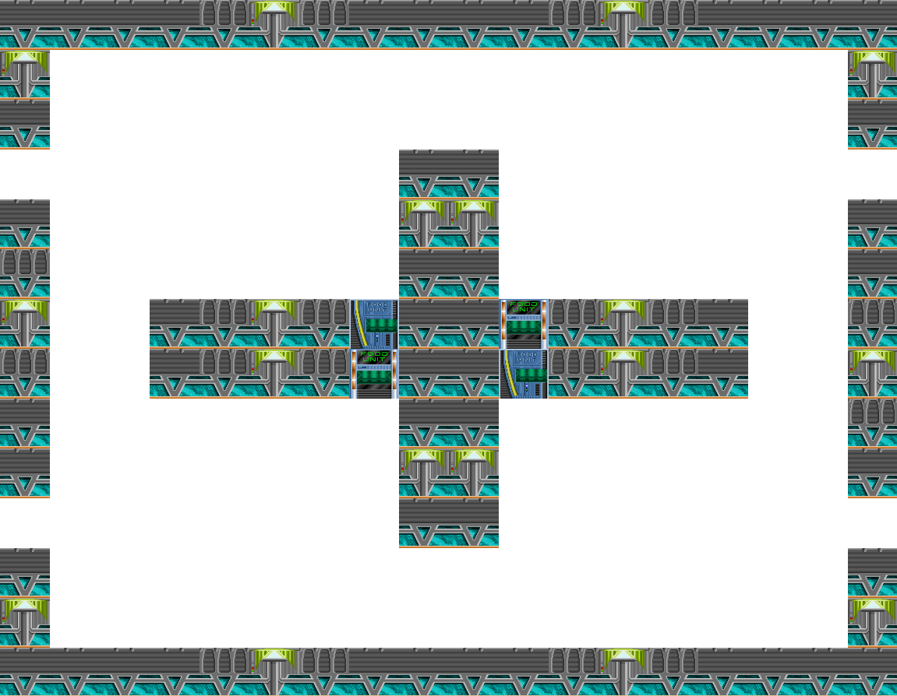
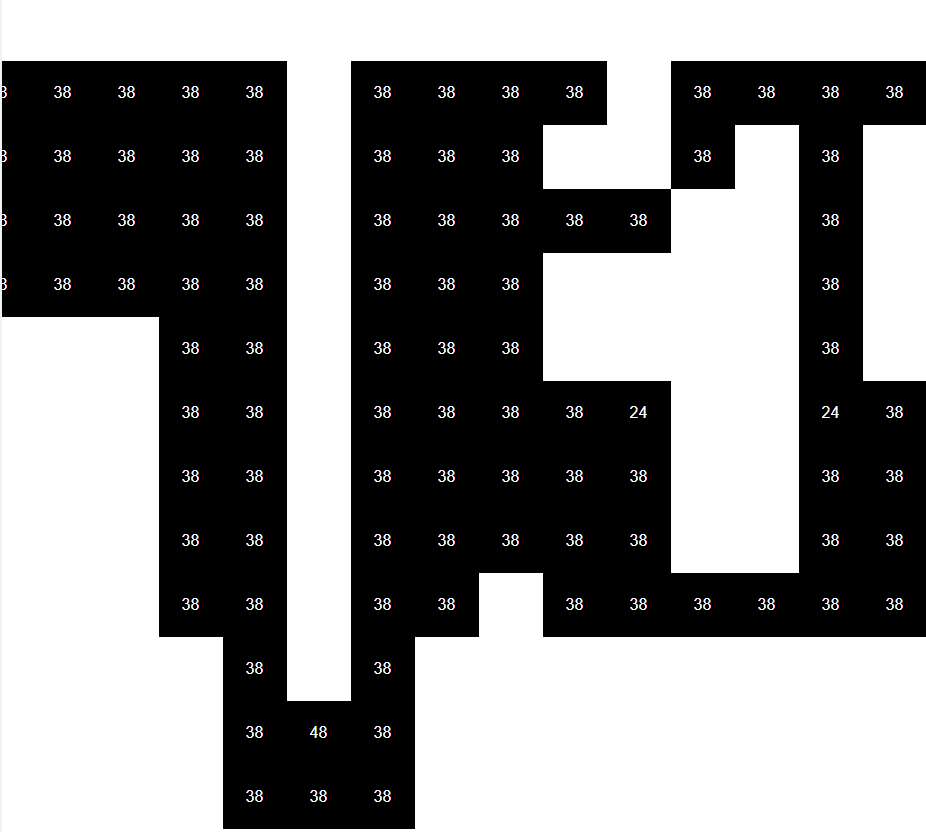
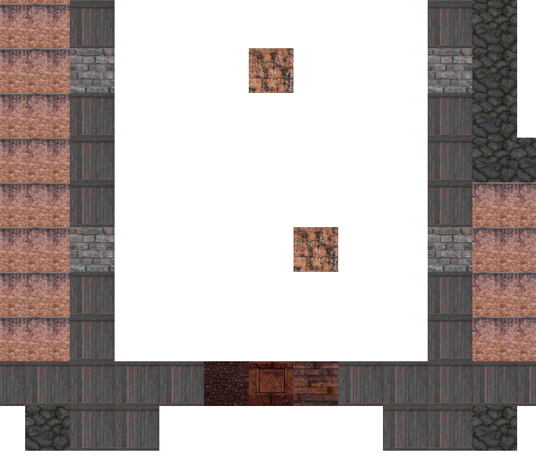
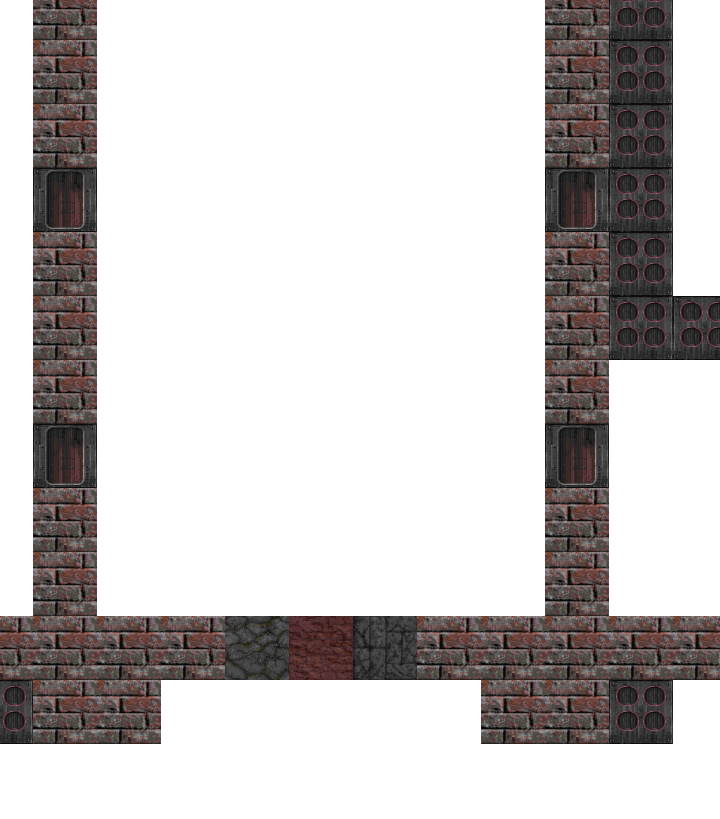
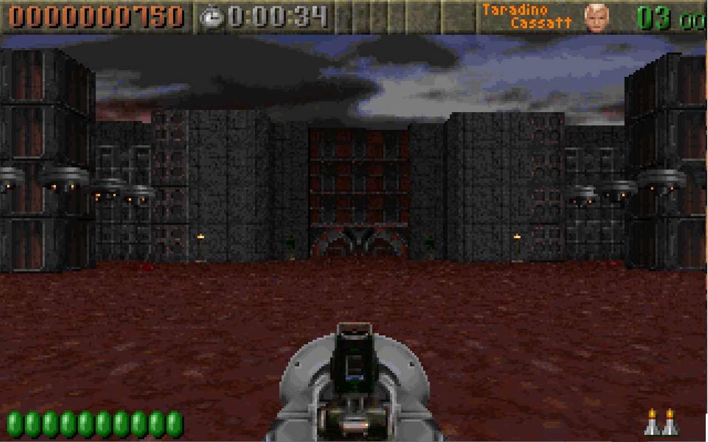
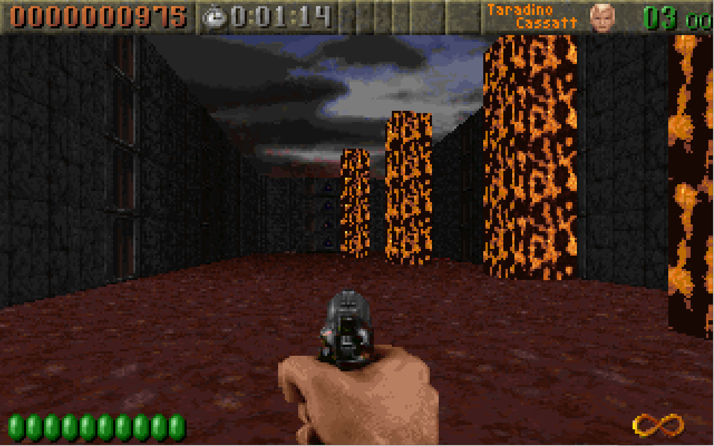
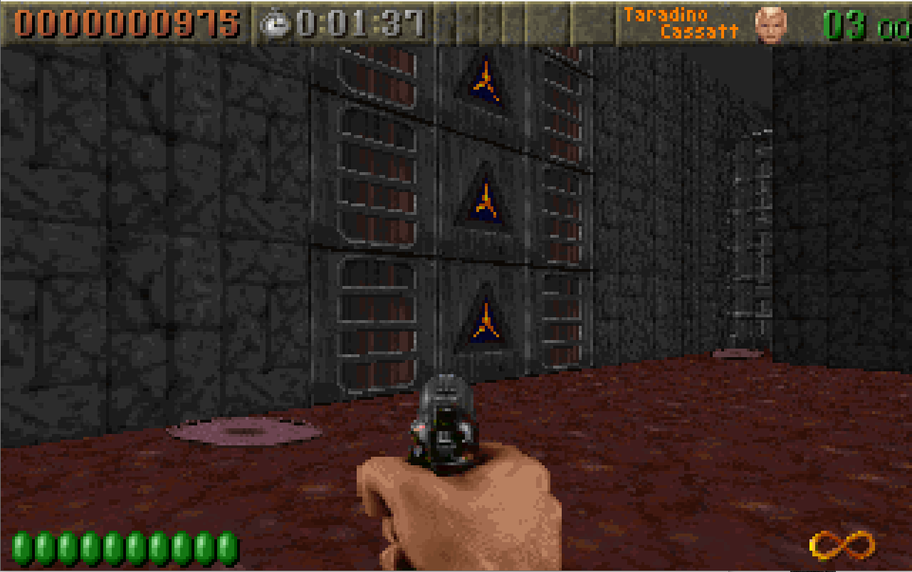
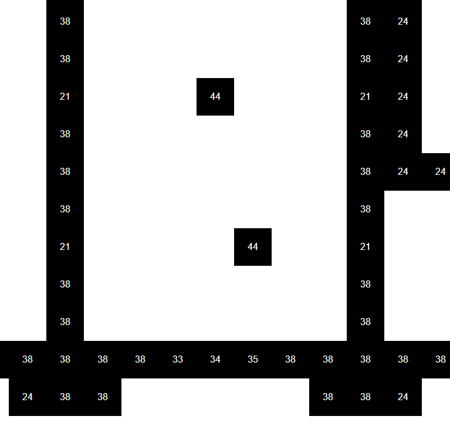
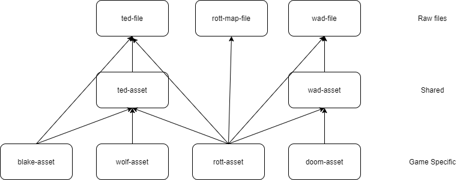

Reading Maps 5: ROTT Textures
=============================

So first thing is let's try to load up a Blake Stone map.  A few things go wrong.  Maps are still 64 x 64 but I noticed that this is hardcoded when we have the map height and width.  So fix that.  Blake Stone as it turns out doesn't have 3rd map layer and we can tell because the length is given as 0.  So we need to handle that so the layer decompression routine doesn't blow up.  This just means reading the offsets, filtering out and entries of 0 and then taking the length.  While Blake Stone still hardcodes 3 layers the loop is easily updated to handle arbitrary numbers of layers.  We also hardcoded the Wolfenstien pallet so we need to update that.  We just need to add the extension property to the `GameMaps` class (the same happens for VSWAP too to show sprites) and so when rendering the map we check if the extension matches Blake Stone, otherwise we default Wolfenstien.  Easy fixes and we have Floor 1 of Blake Stone: Aliens of Gold (or at least as much of it as I can fit for a screenshot, if you played it you know where this is):



# Rise of the Triad

At some point this blog was about Rise of the Triad.  Let's get back to that and see how much we can render.  It seems like when we optimized the map loading we lost our "walless" rendering.  So let's restore that and then pipe the RTL file layers into a `ted-map`.



Too zoomed in to tell exactly what we are looking at but at least we have it running through `ted-map`.  Next let's try to get the walls.

ROTT defined a constant for the number of walls called `MAXWALLTILES` which is set to 105.  There are 105 stucts that look like this:

```c
typedef struct
{ thingtype   which;
  byte        flags;
  byte        hitpoints;
  word        tile;
  byte        tilex,tiley;
} wall_t;
```

It's not clear what all this means yet.  But tracing some stuff back we find `GetLumpForTile` in the source and it looks like this:

```c
int GetLumpForTile(int tile)
   {
   int wallstart;
   int exitstart;

	wallstart=W_GetNumForName("WALLSTRT");
	exitstart=W_GetNumForName("EXITSTRT");
	elevatorstart = W_GetNumForName("ELEVSTRT");

   if ((tile >= 1) && (tile <= 32))
      {
      return (tile + wallstart);
      }
   else if ((tile >= 36) && (tile <= 45))
      {
      return (tile + wallstart - 3);
      }
   else if (tile == 46)
      {
      return (wallstart + 74);
      }
   else if ((tile >= 47) && (tile <= 48))
      {
      return (tile + exitstart - 46);
      }
   else if ((tile >= 49) && (tile <= 71))
      {
      return (tile + wallstart - 8);
      }
   else if ((tile >= 72) && (tile <= 79))
      {
      return (tile - 72 + elevatorstart + 1);
      }
   else if ((tile >= 80) && (tile <= 89))
      {
      return (tile + wallstart - 16);
      }
   return -1;
}
```

If we look at the first condition we see that tiles < 32 simply map to their wad offset.  Try this out and here's the first fire wall hallway of The Hunt Begins:



Eh, that's not right.  Because we start at 1 we need to subtract 1 from the asset index:




So this is kinda right but still wierd.  Let's compare to what we see when playing in DOSBOX:

The first room looking north toward the door:

Looking north from the door in hallway 1:

Looking north-east at the back of hallway 1:


The metal panel texture does look like it's in the right place.  At the back of this hallway is a triad logo with 2 slatted metal panels, this looks correct.  The bricks are not the right texture, in game they look like texture 45.  The door is wrong (this is somewhat expected since it's a special case) and the fire walls have disappeared.  Let's also look at the no texture mode:



Well it's clear what happened.  These walls have indicies greater than 32 so checking the code above it appears we have to do some weird offsetting.  Defintinely not as intuitive as Wolfenstien.  There's a lot going on.

At this point we have something reasonable but there's a lot of other topics to explore like masked walls, push walls, doors and actors.

Note on File Conventions
------------------------

As I work I'm starting to see the limitations of my file naming convention.  I've renamed things to have more of a common convention. Until I find a better one, to keep things straight the idea is this:  `{game}-asset.js` are high-level function unique to a particular game, they may call into the mid-level `{wad/ted}-asset.js` which has things that are common to TED or WAD files.  Finally, `rott-map-file` (formerly `rtl-file` but that is a bad convention due to RTC files), `ted-file` and `wad-file` (formaly `wad`) are both for raw entry extraction and file meta data, and they are always suffixed with "File" and can be directly used by anything down the chain.



Aside: Bugs
-----------

I spent about an hour pulling my hair out because the map would constantly autoscroll to the left and lists would not scroll properly.  I first thought it was a browser quirk but it happened in Firefox as well.  Then I assumed it was a stuck mouse button but using another mouse caused the same thing.  Then I noticed it happening in some other apps.  I unplugged my keyboard, still scrolling.  I tried out the asset-reader on another computer and it worked.  I rebooted and it still didn't.  Ultimately, the culprit was a bluetooth adaptor.  Yeah, apparently it can stuck...across reboots.  Who knew?  Unplugging and plugging it back in fixed it.  Sometimes those bugs you find can come from the weirdest places.

Aside: Custom Element Loading States
------------------------------------

The `table-pic` component used by the visual aids had a visual flaw when loading.  Since this takes non-trivial time to download and parse it would flicker as the element started in a compressed state and then expanded to the loaded image.  This is easy to fix.  We just need to start with a `display: none` on the `:host`, and then at the end of loading we add a class `hydrated` to the `:host` and set `:host(.hydrated)` back to the display value we want.  This isn't fullproof as it can still cause layout instability as it pushed things around (we'd need to precalculate the size to fix that) but for a simple page with no elements this works just fine. 